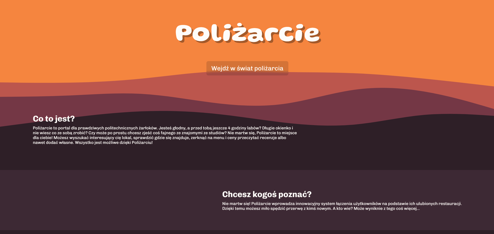
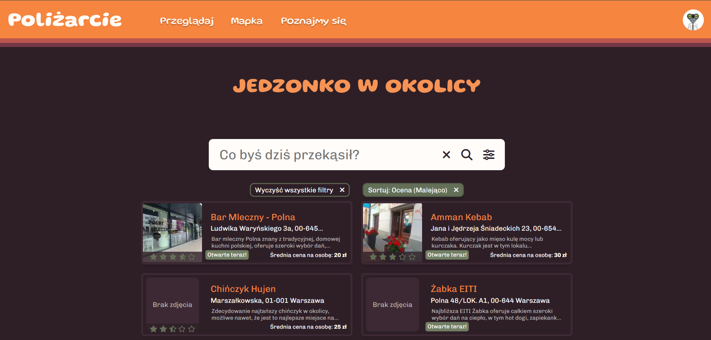
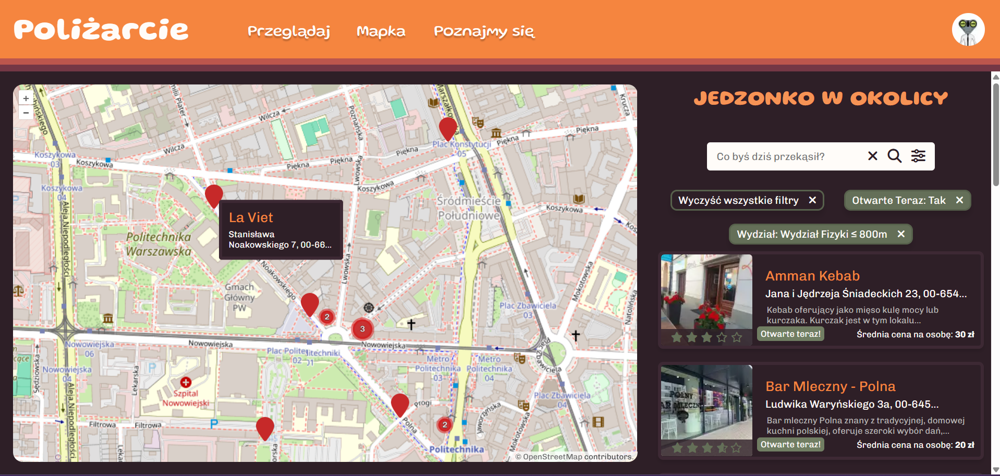
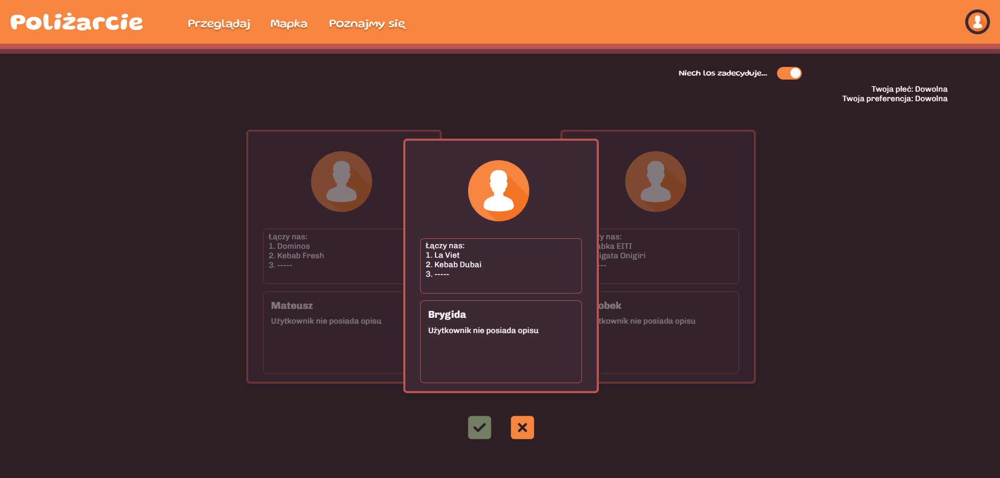
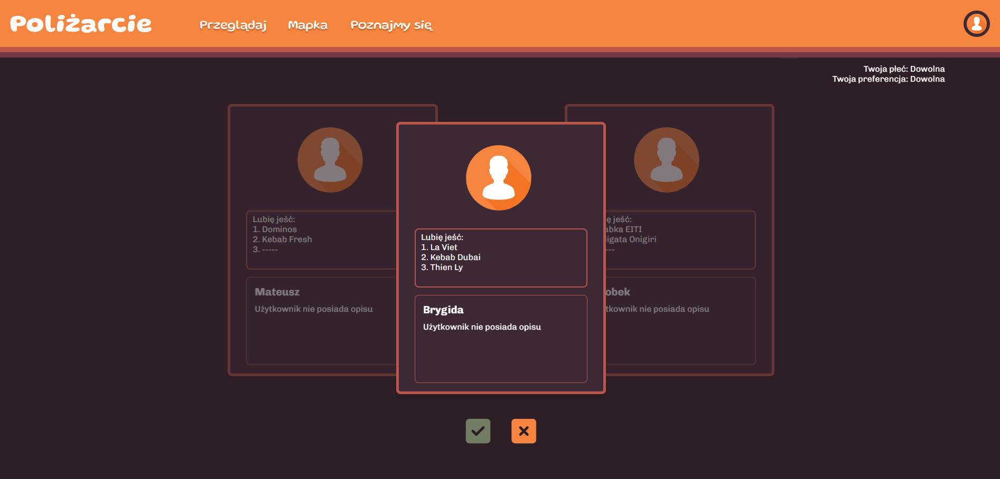
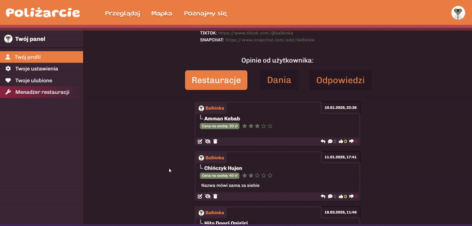
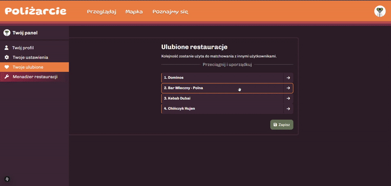

# Poliżarcie

Poliżarcie is a platform that lets students from WUT find new and intereseting places to eat.
It allows for browsing through a search bar or using an interactive map.
You can write reviews, respond to others and match with different users based on your tastes, all in Poliżarcie.

## Integrated and used technologies:

  
  
  
  
  
  
  
  
  
  
  
  
  
  
  

## Screenshots

### Landing Page

### Restaurant Browsing

### Restaurant Map

### Matching With Other students

#### Based On Favorite Restaurants

#### Free Mode

### Profile Page

